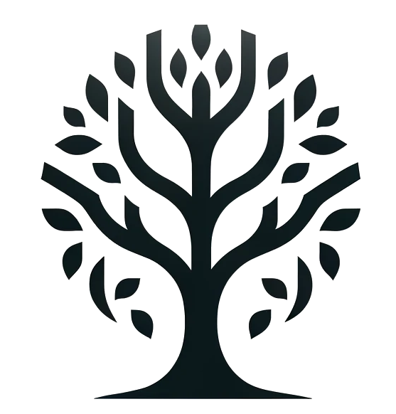

YGGDRASIL
=====

<div align="justify">



YGGDRASIL: Yielder of Galactic Groups and Dynamic Rungs, Architectural Structuring In Layers — The [CO*N*CEPT](https://github.com/jmd-dk/concept/) halo finder.

    Yggdrasil is the immense tree that connects the nine worlds in Norse cosmology. 
    This symbol of connection and structure perfectly matches the concept of build-
    ing a hierarchy of cosmic structures.

The algorithm of YGGDRASIL starts with a friends-of-friends clustering. YGGDRASIL has been developed on top of the friends-of-friends cluster finding in python [pyfof](https://github.com/simongibbons/pyfof) that implements the friends-of-friends algorithm to find clusters of points, accelerated with an R*-tree.

## Requirements
 * c++17 complient compiler
 * [Cython](http://cython.org/)
 * [numpy](http://www.numpy.org/)
 * [boost](http://www.boost.org/)

## Installation

If your boost installation is in a normal place you should just be able to install
the latest release of the package directly from PyPI

```pip install --use-pep517 .```

## Example

### Two Gaussian blobs

```python
import numpy as np
import matplotlib.pyplot as plt
import matplotlib.cm as cm
import ygg

npts = 10000
data = np.vstack((np.random.normal(-1,0.2,(npts//2,2)),\
                  np.random.normal(1,0.2,(npts//2,2))))

groups = ygg.friends_of_friends(data, 0.4)

colors = cm.rainbow(np.linspace(0, 1, len(groups)))
for g,c in zip(groups, colors):
    plt.scatter(data[g,0], data[g,1], color=c, s=3)

plt.show()
```

</div>